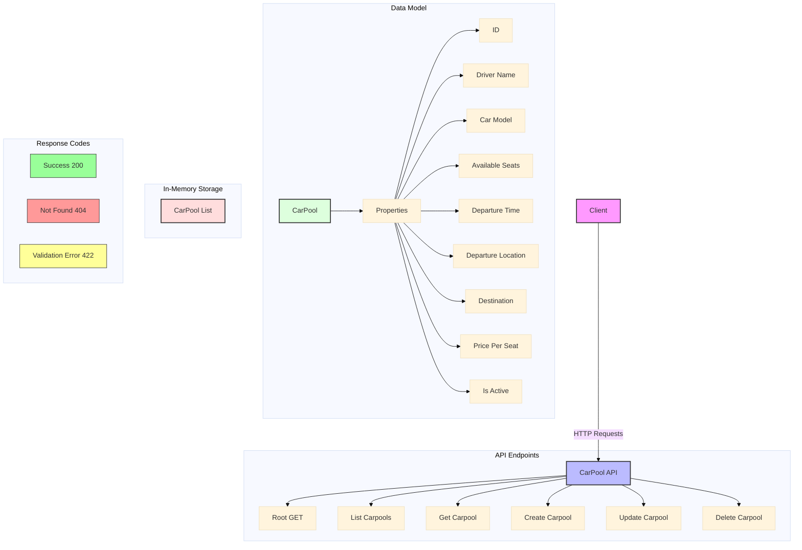

# CarPool API Architecture

## Components

1. **Client**
   - Makes HTTP requests to the API
   - Can be a web application, mobile app, or other service

2. **API Endpoints**
   - Root endpoint (`/`): Welcome message
   - List all carpools (`GET /carpools`)
   - Get specific carpool (`GET /carpools/{id}`)
   - Create carpool (`POST /carpools`)
   - Update carpool (`PUT /carpools/{id}`)
   - Delete carpool (`DELETE /carpools/{id}`)

3. **Data Model (CarPool)**
   - Unique identifier (id)
   - Driver information (name, car model)
   - Trip details (seats, departure time, locations)
   - Pricing (price per seat)
   - Status (active/inactive)

4. **Storage**
   - In-memory list of CarPool objects
   - Each operation (CRUD) interacts with this storage

5. **Response Codes**
   - 200: Successful operation
   - 404: Resource not found
   - 422: Validation error (e.g., negative values)

## Data Flow

1. **Create Flow**
   ```
   Client -> POST /carpools -> Validate Data -> Create CarPool -> Store -> Return Created
   ```

2. **Read Flow**
   ```
   Client -> GET /carpools/{id} -> Find CarPool -> Return Data
   ```

3. **Update Flow**
   ```
   Client -> PUT /carpools/{id} -> Validate Data -> Update CarPool -> Store -> Return Updated
   ```

4. **Delete Flow**
   ```
   Client -> DELETE /carpools/{id} -> Find CarPool -> Remove -> Return Success
   ```

## Validation Rules

1. **Required Fields**
   - All fields except `id` are required
   - `id` is auto-generated

2. **Value Constraints**
   - `available_seats` must be > 0
   - `price_per_seat` must be > 0
   - `departure_time` must be a valid datetime

3. **Default Values**
   - `is_active` defaults to `True`
   - `id` is `None` for new carpools 