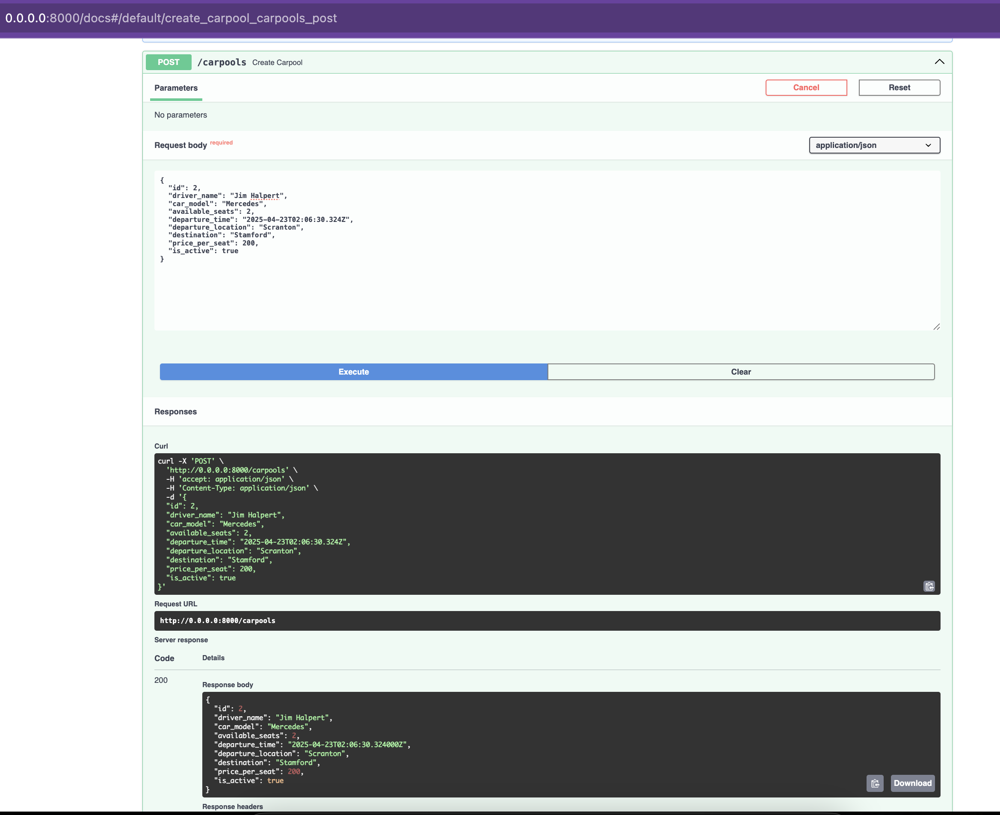
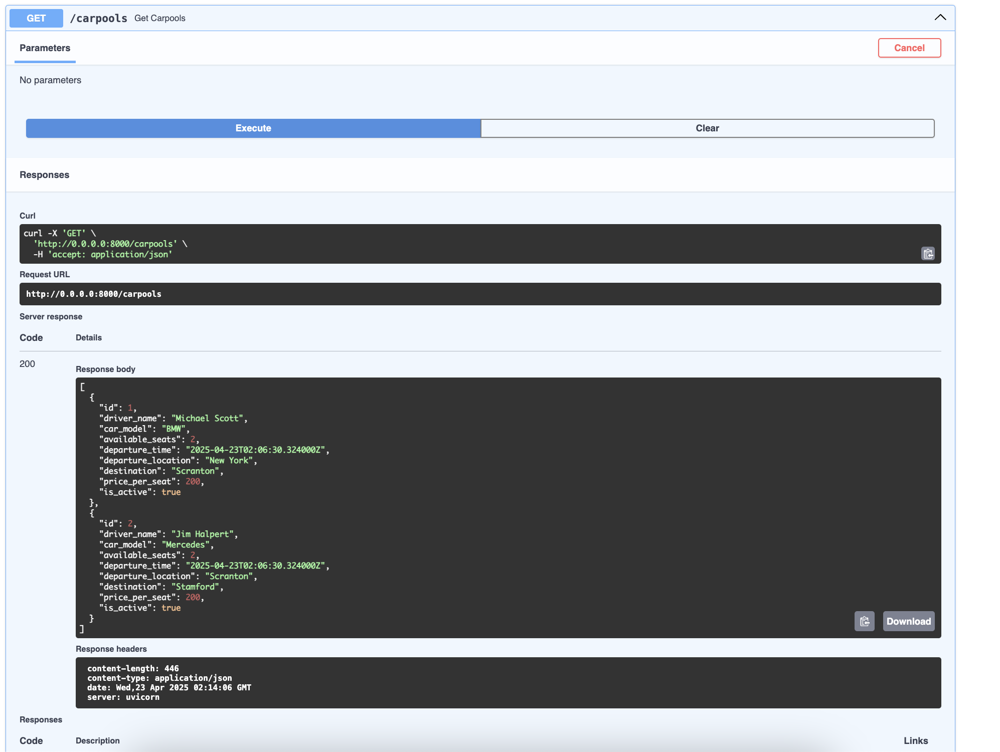
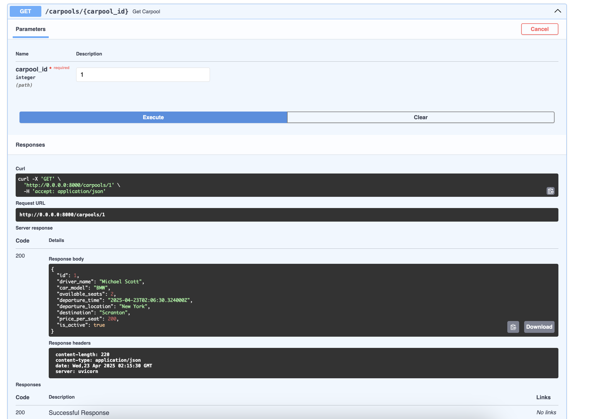
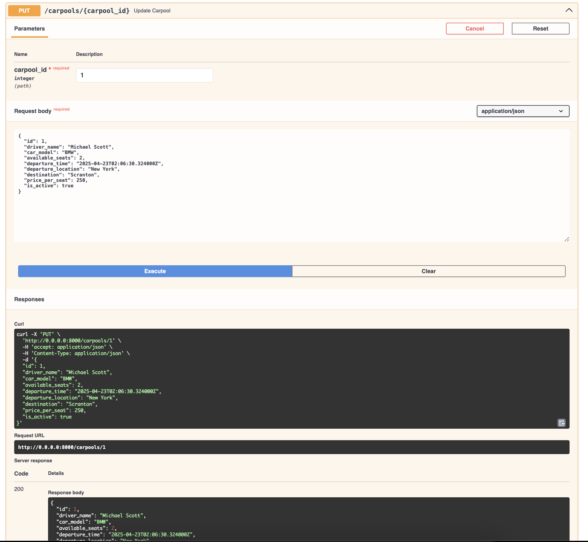
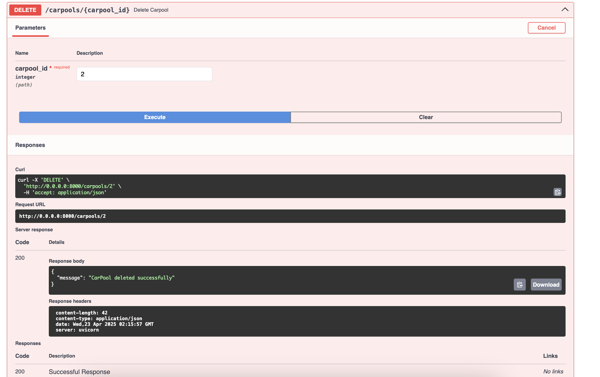

# CarPool API

A FastAPI-based REST API for managing carpool services. This API allows users to create, read, update, and delete carpool listings.

## Features

- Input validation using Pydantic models
- Proper error handling with HTTP exceptions
- Response models for consistent API responses
- In-memory storage (can be replaced with a database in production)
- Automatic API documentation with Swagger UI and ReDoc

## Data Model

The `CarPool` model includes the following fields:
- `driver_name`: Name of the driver
- `car_model`: Model of the car
- `available_seats`: Number of available seats
- `departure_time`: Scheduled departure time
- `departure_location`: Starting point of the carpool
- `destination`: Final destination
- `price_per_seat`: Cost per seat
- `is_active`: Status of the carpool listing (default: true)

## API Endpoints

### Base URL
```
http://localhost:8000
```

### Available Endpoints

1. **Welcome Message**
   - `GET /`
   - Returns a welcome message

2. **List All Carpools**
   - `GET /carpools`
   - Returns a list of all carpool listings

3. **Get Specific Carpool**
   - `GET /carpools/{carpool_id}`
   - Returns details of a specific carpool

4. **Create New Carpool**
   - `POST /carpools`
   - Creates a new carpool listing

5. **Update Carpool**
   - `PUT /carpools/{carpool_id}`
   - Updates an existing carpool listing

6. **Delete Carpool**
   - `DELETE /carpools/{carpool_id}`
   - Deletes a carpool listing

## Setup and Installation

1. Create and activate a virtual environment:
```bash
python3 -m venv venv
source venv/bin/activate  # On Windows: venv\Scripts\activate
```

2. Install dependencies:
```bash
pip install -r requirements.txt
```

## Running the Application

Start the server:
```bash
uvicorn main:app --host "0.0.0.0" --port 8000 --reload
```

## API Documentation

Once the server is running, you can access the API documentation at:

- Swagger UI: http://localhost:8000/docs
- ReDoc: http://localhost:8000/redoc

## Example Requests

### Create a Carpool
```bash
curl -X POST "http://localhost:8000/carpools" \
     -H "Content-Type: application/json" \
     -d '{
           "driver_name": "John Doe",
           "car_model": "Toyota Camry",
           "available_seats": 3,
           "departure_time": "2024-03-20T08:00:00",
           "departure_location": "New York",
           "destination": "Boston",
           "price_per_seat": 25.50
         }'
```

### Get All Carpools
```bash
curl "http://localhost:8000/carpools"
```

### Get Specific Carpool
```bash
curl "http://localhost:8000/carpools/1"
```

## Error Handling

The API returns appropriate HTTP status codes:
- 200: Successful request
- 404: Resource not found
- 422: Validation error

### Screenshots









